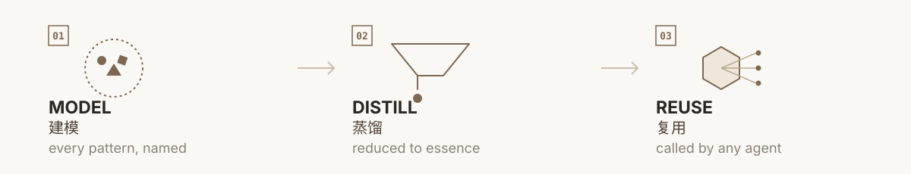

<p align="center">
  
</p>

modelosophy turns centuries of human thinking frameworks into AI Skills an agent can call.

SWOT, first principles, MECE, compound thinking, second-order thinking — each mental model becomes an independent, composable Skill instead of a paragraph in a wiki. An AI agent uses them the way a person would: to break down a problem, build a strategy, or make a decision.

## What's here now

This repository is early. There are **232** executable Skills under `skills/<category>/` (category READMEs remain the per-domain index; `_templates` is not a skill).

Useful fields from an earlier “9-field card” draft (author, misuse, memory hook, …) may be absorbed into executable `SKILL.md` sections; cards are **not** the primary deliverable. Plan: [`ROADMAP.md`](ROADMAP.md).

### Business (1)

Vendor-neutral org / IT intelligence.

- **[org-it-intel-report](skills/business/org-it-intel-report/SKILL.md)** — Org / IT intelligence report: McKinsey-style org overview plus IT investment & procurement (vendor-neutral).

### Thinking models (50)

General reasoning, strategy, learning, leadership, and related frameworks (**50**). Another **19** formerly here now live in the domain categories below — listed only under their new homes.

- **[abductive-reasoning](skills/thinking-models/abductive-reasoning/SKILL.md)** — Abductive reasoning: from a surprising observation, generate and pick the best current explanation (IBE), marking what still needs testing.
- **[antifragility](skills/thinking-models/antifragility/SKILL.md)** — Antifragility: design strategies that gain from volatility and uncertainty—not merely withstand risk.
- **[contrarian-and-right](skills/thinking-models/contrarian-and-right/SKILL.md)** — Contrarian and right: test unconventional views—outsized insight needs both divergence from consensus and falsifiable correctness.
- **[counterfactual-thinking](skills/thinking-models/counterfactual-thinking/SKILL.md)** — Counterfactual thinking: handle “if only…” mental simulations; separate upward/downward counterfactuals and controllable causes.
- **[critical-thinking](skills/thinking-models/critical-thinking/SKILL.md)** — Critical thinking: Facione Delphi skills (interpretation, analysis, evaluation, inference, explanation, self-regulation).
- **[decision-tree](skills/thinking-models/decision-tree/SKILL.md)** — Decision tree: multi-stage choices with known options, uncertain outcomes, and estimable probabilities/payoffs.
- **[deductive-reasoning](skills/thinking-models/deductive-reasoning/SKILL.md)** — Deductive reasoning: from accepted premises, derive conclusions that must follow by valid rules.
- **[dissipative-structures](skills/thinking-models/dissipative-structures/SKILL.md)** — Dissipative structures: diagnose whether an open system far from equilibrium can form new order via amplified fluctuations.
- **[dual-goal-list](skills/thinking-models/dual-goal-list/SKILL.md)** — Dual goal list (25/5): write ~25 goals, keep Top 5 as List A, and treat the rest as active avoidance.
- **[dual-process](skills/thinking-models/dual-process/SKILL.md)** — Dual process: Kahneman System 1 vs System 2—when to trust intuition and when to force slow thinking.
- **[economic-moat](skills/thinking-models/economic-moat/SKILL.md)** — Economic moat: assess whether a firm can sustain excess returns via durable competitive advantages.
- **[eisenhower-matrix](skills/thinking-models/eisenhower-matrix/SKILL.md)** — Eisenhower matrix: sort work by urgent×important; prioritize important-but-not-urgent.
- **[emotional-abc](skills/thinking-models/emotional-abc/SKILL.md)** — Emotional ABC (REBT): split strong emotion into Activating event, Beliefs, and Consequences.
- **[expected-value](skills/thinking-models/expected-value/SKILL.md)** — Expected value: quantify uncertain outcomes as probability-weighted averages (EV = Σ p·x).
- **[feynman-technique](skills/thinking-models/feynman-technique/SKILL.md)** — Feynman technique: expose gaps by teaching a concept in plain language, then repair and retry.
- **[first-principles](skills/thinking-models/first-principles/SKILL.md)** — First principles: strip a claim to hard facts/constraints, then rebuild upward without analogy crutches.
- **[five-w-one-h](skills/thinking-models/five-w-one-h/SKILL.md)** — 5W1H: nail Who/What/When/Where/Why/How slots for an event, need, or task.
- **[flow](skills/thinking-models/flow/SKILL.md)** — Flow: diagnose deep engagement when challenge≈skill, goals are clear, and feedback is timely.
- **[flywheel](skills/thinking-models/flywheel/SKILL.md)** — Flywheel: design or diagnose accelerating causal loops where each turn strengthens the next.
- **[fogg-behavior-model](skills/thinking-models/fogg-behavior-model/SKILL.md)** — Fogg behavior model (B=MAP): diagnose why a behavior happens or fails via Motivation×Ability×Prompt.
- **[forgetting-curve](skills/thinking-models/forgetting-curve/SKILL.md)** — Forgetting curve: fight memory decay with spaced retrieval instead of one-shot cramming.
- **[gaslighting](skills/thinking-models/gaslighting/SKILL.md)** — Gaslighting: spot manipulation that denies someone’s perception/memory to seize definition of reality.
- **[golden-circle](skills/thinking-models/golden-circle/SKILL.md)** — Golden Circle: structure narrative as WHY→HOW→WHAT (purpose before product).
- **[hook-model](skills/thinking-models/hook-model/SKILL.md)** — Hook Model: design habit loops as Trigger→Action→Variable Reward→Investment.
- **[iceberg-model](skills/thinking-models/iceberg-model/SKILL.md)** — Iceberg model: dig under visible behavior/artifacts to assumptions and culture layers.
- **[implicit-premises](skills/thinking-models/implicit-premises/SKILL.md)** — Implicit premises: surface unstated premises that carry an argument, then classify and test them.
- **[inversion](skills/thinking-models/inversion/SKILL.md)** — Inversion: work backward from failure—“how could this go wrong?”—then avoid those paths.
- **[johari-window](skills/thinking-models/johari-window/SKILL.md)** — Johari window: expand the open quadrant via feedback and disclosure to reduce blind spots.
- **[ladder-of-inference](skills/thinking-models/ladder-of-inference/SKILL.md)** — Ladder of inference: unpack the climb from selected data to meaning, belief, and action.
- **[leverage](skills/thinking-models/leverage/SKILL.md)** — Leverage: find high-impact intervention points (Meadows-style) where small moves change system behavior.
- **[local-global-optima](skills/thinking-models/local-global-optima/SKILL.md)** — Local vs global optima: ask whether polishing the current path is stuck on a small hill.
- **[long-term-thinking](skills/thinking-models/long-term-thinking/SKILL.md)** — Long-term thinking: place decisions in multi-period consequences and incentive cycles.
- **[maslow-hierarchy](skills/thinking-models/maslow-hierarchy/SKILL.md)** — Maslow hierarchy: use need categories as a checklist (not a universal law).
- **[mece](skills/thinking-models/mece/SKILL.md)** — MECE: split issues into mutually exclusive, collectively exhaustive categories.
- **[metacognition](skills/thinking-models/metacognition/SKILL.md)** — Metacognition: monitor and regulate your own thinking—notice misunderstanding and switch strategies.
- **[munger-misjudgment](skills/thinking-models/munger-misjudgment/SKILL.md)** — Psychology of human misjudgment: scan Munger’s tendencies and Lollapalooza stacking.
- **[negentropy](skills/thinking-models/negentropy/SKILL.md)** — Negentropy: track how open systems import free energy/information to keep local order.
- **[occams-razor](skills/thinking-models/occams-razor/SKILL.md)** — Occam’s razor: among explanations that fit, prefer fewer ad hoc assumptions—then verify.
- **[pdca](skills/thinking-models/pdca/SKILL.md)** — PDCA: Plan–Do–Check/Study–Act continuous improvement loops with explicit measures.
- **[porters-five-forces](skills/thinking-models/porters-five-forces/SKILL.md)** — Porter’s five forces: diagnose industry profit structure via rivalry, entrants, substitutes, buyers, suppliers.
- **[process-replication](skills/thinking-models/process-replication/SKILL.md)** — Process replication: distill success into transferable steps, adapt to local constraints, then scale.
- **[pyramid-principle](skills/thinking-models/pyramid-principle/SKILL.md)** — Pyramid principle: lead with the answer; group supporting arguments MECE under it.
- **[redundancy](skills/thinking-models/redundancy/SKILL.md)** — Redundancy: design spare capacity, paths, or copies against single points of failure.
- **[situational-leadership](skills/thinking-models/situational-leadership/SKILL.md)** — Situational leadership: match style to a follower’s readiness (ability×willingness) on a specific task.
- **[six-thinking-hats](skills/thinking-models/six-thinking-hats/SKILL.md)** — Six Thinking Hats: separate facts, feelings, benefits, risks, and ideas in parallel meeting modes.
- **[socratic-questioning](skills/thinking-models/socratic-questioning/SKILL.md)** — Socratic questioning: test a claim by elenchus—questions that surface contradictions—not by assertion.
- **[spiral-of-silence](skills/thinking-models/spiral-of-silence/SKILL.md)** — Spiral of silence: fear of isolation → misread climate → minority silence → louder majority.
- **[swot](skills/thinking-models/swot/SKILL.md)** — SWOT: structure internal strengths/weaknesses × external opportunities/threats, then TOWS matching.
- **[ten-ten-ten](skills/thinking-models/ten-ten-ten/SKILL.md)** — 10/10/10: pull decisions out of hot emotion by checking ~10 minutes / 10 months / 10 years.
- **[tipping-point](skills/thinking-models/tipping-point/SKILL.md)** — Tipping point: spot nonlinear phase changes near critical mass after threshold crossing.

### Macroeconomic theories (30)

Classic macro frameworks (**30**; mostly `v0.x-draft`).

- **[invisible-hand](skills/econ-macro-theories/invisible-hand/SKILL.md)** — Invisible hand: decentralized choices can coordinate allocation via price signals without a central planner.
- **[keynesianism](skills/econ-macro-theories/keynesianism/SKILL.md)** — Keynesianism: when effective demand is weak, countercyclical fiscal/monetary stimulus can lift spending.
- **[monetarism](skills/econ-macro-theories/monetarism/SKILL.md)** — Monetarism: inflation is ultimately a monetary phenomenon; prefer rules over fine-tuned stimulus.
- **[supply-side-economics](skills/econ-macro-theories/supply-side-economics/SKILL.md)** — Supply-side economics: raise potential output via production-side incentives (taxes, regulation), not only demand.
- **[laffer-curve](skills/econ-macro-theories/laffer-curve/SKILL.md)** — Laffer curve: tax revenue rises then falls as rates go 0→100%; too-high rates can shrink the base.
- **[austrian-school](skills/econ-macro-theories/austrian-school/SKILL.md)** — Austrian school: subjective value, entrepreneurial discovery, spontaneous order; wary of credit-driven distortion.
- **[rational-expectations](skills/econ-macro-theories/rational-expectations/SKILL.md)** — Rational expectations: agents use available info to anticipate policy, so systematic “tricks” rarely last.
- **[modern-monetary-theory](skills/econ-macro-theories/modern-monetary-theory/SKILL.md)** — MMT: for a sovereign currency issuer, the hard constraint is inflation/real resources—not household-style “tax first.”
- **[phillips-curve](skills/econ-macro-theories/phillips-curve/SKILL.md)** — Phillips curve: short-run inflation–unemployment tradeoff; long run may be vertical at natural unemployment.
- **[okuns-law](skills/econ-macro-theories/okuns-law/SKILL.md)** — Okun’s law: faster growth vs potential usually lowers unemployment (empirical rule, not identity).
- **[is-lm-model](skills/econ-macro-theories/is-lm-model/SKILL.md)** — IS–LM: short-run fixed-price link of goods (IS) and money (LM) markets via the interest rate.
- **[ad-as-model](skills/econ-macro-theories/ad-as-model/SKILL.md)** — AD–AS: aggregate demand and supply jointly determine the price level and output.
- **[multiplier-effect](skills/econ-macro-theories/multiplier-effect/SKILL.md)** — Multiplier effect: autonomous spending can amplify into larger output changes via income–consumption chains.
- **[crowding-out-effect](skills/econ-macro-theories/crowding-out-effect/SKILL.md)** — Crowding out: government borrowing may raise rates or bid away real resources from private spending.
- **[ricardian-equivalence](skills/econ-macro-theories/ricardian-equivalence/SKILL.md)** — Ricardian equivalence: under strict assumptions, debt-financed vs tax-financed spending leaves consumption unchanged.
- **[tobins-q](skills/econ-macro-theories/tobins-q/SKILL.md)** — Tobin’s Q: market value vs replacement cost of assets; Q>1 favors expansion.
- **[trickle-down-economics](skills/econ-macro-theories/trickle-down-economics/SKILL.md)** — Trickle-down: claim that gains at the top percolate downward—often weakly evidenced and easily misused.
- **[kuznets-curve](skills/econ-macro-theories/kuznets-curve/SKILL.md)** — Kuznets curve: inequality may rise then fall with development—a hypothesis, not a law.
- **[malthusian-trap](skills/econ-macro-theories/malthusian-trap/SKILL.md)** — Malthusian trap: pre-industrial productivity gains often absorbed by population, stalling per-capita rise.
- **[solow-growth-model](skills/econ-macro-theories/solow-growth-model/SKILL.md)** — Solow growth: capital has diminishing returns; long-run per-capita growth rests mainly on exogenous technical progress.
- **[endogenous-growth-theory](skills/econ-macro-theories/endogenous-growth-theory/SKILL.md)** — Endogenous growth: knowledge, human capital, and innovation investment make long-run growth an economic choice.
- **[creative-destruction](skills/econ-macro-theories/creative-destruction/SKILL.md)** — Creative destruction: innovation rebuilds higher productivity by destroying old products, firms, and skills.
- **[kondratiev-wave](skills/econ-macro-theories/kondratiev-wave/SKILL.md)** — Kondratiev wave: alleged ~40–60 year tech–price long cycles; evidence and mechanism remain debated.
- **[juglar-cycle](skills/econ-macro-theories/juglar-cycle/SKILL.md)** — Juglar cycle: ~7–11 year medium business cycle often tied to fixed-capital / equipment investment.
- **[kitchin-cycle](skills/econ-macro-theories/kitchin-cycle/SKILL.md)** — Kitchin cycle: ~3–5 year (often ~40-month) short cycle driven mainly by inventory adjustment.
- **[impossible-trinity](skills/econ-macro-theories/impossible-trinity/SKILL.md)** — Impossible trinity: free capital flow, fixed FX, and independent monetary policy—pick at most two.
- **[purchasing-power-parity](skills/econ-macro-theories/purchasing-power-parity/SKILL.md)** — Purchasing power parity: long-run FX should equalize basket purchasing power across countries (relative/absolute PPP).
- **[fisher-equation](skills/econ-macro-theories/fisher-equation/SKILL.md)** — Fisher / quantity equation (MV=PQ): money×velocity ≈ price level×output—nominal anchoring intuition.
- **[taylor-rule](skills/econ-macro-theories/taylor-rule/SKILL.md)** — Taylor rule: set policy rates from inflation gap and output gap systematically.
- **[balance-sheet-recession](skills/econ-macro-theories/balance-sheet-recession/SKILL.md)** — Balance-sheet recession: after a bubble burst, firms prioritize debt minimization even at near-zero rates.

### Microeconomics & markets (30)

Micro / market mechanisms (**30**).

- **[supply-and-demand](skills/econ-micro-markets/supply-and-demand/SKILL.md)** — Supply and demand: price emerges from both sides, not unilateral will.
- **[equilibrium-price](skills/econ-micro-markets/equilibrium-price/SKILL.md)** — Equilibrium price: market-clearing price where quantity supplied equals quantity demanded.
- **[price-elasticity](skills/econ-micro-markets/price-elasticity/SKILL.md)** — Price elasticity: how sensitive quantity is to price changes.
- **[diminishing-marginal-utility](skills/econ-micro-markets/diminishing-marginal-utility/SKILL.md)** — Diminishing marginal utility: each extra unit usually adds less satisfaction.
- **[opportunity-cost](skills/econ-micro-markets/opportunity-cost/SKILL.md)** — Opportunity cost: value of the best forgone alternative under mutually exclusive choices.
- **[comparative-advantage](skills/econ-micro-markets/comparative-advantage/SKILL.md)** — Comparative advantage: specialize where relative cost is lowest, then trade for mutual gains.
- **[consumer-surplus](skills/econ-micro-markets/consumer-surplus/SKILL.md)** — Consumer surplus: sum of gaps between willingness to pay and actual price.
- **[producer-surplus](skills/econ-micro-markets/producer-surplus/SKILL.md)** — Producer surplus: gap between price and seller marginal cost (or minimum willingness to sell).
- **[economies-of-scale](skills/econ-micro-markets/economies-of-scale/SKILL.md)** — Economies of scale: long-run average cost falls as output expands.
- **[economies-of-scope](skills/econ-micro-markets/economies-of-scope/SKILL.md)** — Economies of scope: producing multiple goods together costs less than producing them separately.
- **[diminishing-returns](skills/econ-micro-markets/diminishing-returns/SKILL.md)** — Diminishing returns: with other inputs fixed, extra units of one input eventually add less output.
- **[externality](skills/econ-micro-markets/externality/SKILL.md)** — Externality: effects on bystanders not reflected in market prices.
- **[public-goods](skills/econ-micro-markets/public-goods/SKILL.md)** — Public goods: non-excludable and non-rival; markets often undersupply them.
- **[tragedy-of-the-commons](skills/econ-micro-markets/tragedy-of-the-commons/SKILL.md)** — Tragedy of the commons: rival shared resources tend to be overused and depleted.
- **[asymmetric-information](skills/econ-micro-markets/asymmetric-information/SKILL.md)** — Asymmetric information: one side knows critically more than the other.
- **[lemons-market](skills/econ-micro-markets/lemons-market/SKILL.md)** — Lemons market: quality asymmetry can drive bad products to crowd out good ones.
- **[moral-hazard](skills/econ-micro-markets/moral-hazard/SKILL.md)** — Moral hazard: after contracting, one party changes hidden behavior because they don’t bear full consequences.
- **[adverse-selection](skills/econ-micro-markets/adverse-selection/SKILL.md)** — Adverse selection: before contracting, the less-informed side disproportionately attracts “bad” counterparties.
- **[principal-agent](skills/econ-micro-markets/principal-agent/SKILL.md)** — Principal–agent: agents don’t fully act for principals when goals and information diverge.
- **[signaling](skills/econ-micro-markets/signaling/SKILL.md)** — Signaling: costly, observable actions used to prove a hidden type.
- **[price-discrimination](skills/econ-micro-markets/price-discrimination/SKILL.md)** — Price discrimination: charging different buyers different prices for the same-cost good.
- **[perfect-competition](skills/econ-micro-markets/perfect-competition/SKILL.md)** — Perfect competition: many small firms, homogeneous goods, everyone a price taker.
- **[monopoly-natural-monopoly](skills/econ-micro-markets/monopoly-natural-monopoly/SKILL.md)** — Monopoly / natural monopoly: sole supply; natural monopoly when one firm is the cheapest way to produce.
- **[oligopoly](skills/econ-micro-markets/oligopoly/SKILL.md)** — Oligopoly: a few large firms strategically watch each other’s price and output.
- **[monopolistic-competition](skills/econ-micro-markets/monopolistic-competition/SKILL.md)** — Monopolistic competition: many firms sell differentiated goods—some pricing power plus intense rivalry.
- **[barriers-to-entry](skills/econ-micro-markets/barriers-to-entry/SKILL.md)** — Barriers to entry: obstacles that block or delay competitive entry.
- **[transaction-costs-coase](skills/econ-micro-markets/transaction-costs-coase/SKILL.md)** — Transaction costs & Coase: with clear rights and low enough costs, parties can bargain externalities; else institutions matter.
- **[pareto-efficiency](skills/econ-micro-markets/pareto-efficiency/SKILL.md)** — Pareto efficiency: no one can be made better off without making someone worse off.
- **[general-equilibrium](skills/econ-micro-markets/general-equilibrium/SKILL.md)** — General equilibrium: linked analysis where all markets clear simultaneously.
- **[veblen-effect](skills/econ-micro-markets/veblen-effect/SKILL.md)** — Veblen effect: higher price raises demand via status/conspicuous signaling.

### Game theory & strategy (31)

Game theory intro slice + 30 named models (**31**).

- **[game-theory](skills/game-theory-models/game-theory/SKILL.md)** — Game theory (intro): players, strategies, payoffs; dominant strategies; Nash intuition; prisoner’s-dilemma demo.
- **[prisoners-dilemma](skills/game-theory-models/prisoners-dilemma/SKILL.md)** — Prisoner’s dilemma: individually rational moves yield collectively worse outcomes.
- **[nash-equilibrium](skills/game-theory-models/nash-equilibrium/SKILL.md)** — Nash equilibrium: a stable profile where no one gains by unilaterally changing strategy.
- **[zero-sum-game](skills/game-theory-models/zero-sum-game/SKILL.md)** — Zero-sum game: one side’s gain equals the other’s loss.
- **[positive-negative-sum-game](skills/game-theory-models/positive-negative-sum-game/SKILL.md)** — Positive/negative-sum games: cooperation can create surplus; conflict can destroy total value.
- **[repeated-games](skills/game-theory-models/repeated-games/SKILL.md)** — Repeated games: long interaction can sustain cooperation (e.g., tit-for-tat).
- **[folk-theorem](skills/game-theory-models/folk-theorem/SKILL.md)** — Folk theorem: in infinitely repeated games, cooperation can be sustained under patience.
- **[subgame-perfect-equilibrium](skills/game-theory-models/subgame-perfect-equilibrium/SKILL.md)** — Subgame-perfect equilibrium: refine Nash by eliminating non-credible threats.
- **[backward-induction](skills/game-theory-models/backward-induction/SKILL.md)** — Backward induction: solve from the last move backward to today’s best action.
- **[bayesian-games](skills/game-theory-models/bayesian-games/SKILL.md)** — Bayesian games: strategic play under incomplete information and beliefs.
- **[signaling-games](skills/game-theory-models/signaling-games/SKILL.md)** — Signaling games: informed senders and uninformed receivers contest information.
- **[boxed-pigs](skills/game-theory-models/boxed-pigs/SKILL.md)** — Boxed pigs: the small pig free-rides while the big pig presses the lever.
- **[chicken-game](skills/game-theory-models/chicken-game/SKILL.md)** — Chicken game: first to yield loses face; mutual hardline crashes both.
- **[stag-hunt](skills/game-theory-models/stag-hunt/SKILL.md)** — Stag hunt: cooperation pays more but requires mutual trust; safe hare is tempting.
- **[coordination-game](skills/game-theory-models/coordination-game/SKILL.md)** — Coordination game: multiple equilibria—players want to match the same one.
- **[hawk-dove](skills/game-theory-models/hawk-dove/SKILL.md)** — Hawk–dove: evolutionary tradeoff between aggression and yielding.
- **[evolutionary-stable-strategy](skills/game-theory-models/evolutionary-stable-strategy/SKILL.md)** — ESS: an evolutionarily stable strategy that resists invasion by mutants.
- **[ultimatum-game](skills/game-theory-models/ultimatum-game/SKILL.md)** — Ultimatum game: responders may reject unfair splits even at a personal cost.
- **[dictator-game](skills/game-theory-models/dictator-game/SKILL.md)** — Dictator game: giving when the receiver has no rejection power.
- **[trust-game](skills/game-theory-models/trust-game/SKILL.md)** — Trust game: first mover risks resources betting on reciprocal return.
- **[centipede-game](skills/game-theory-models/centipede-game/SKILL.md)** — Centipede game: rational early stop vs observed cooperation along the path.
- **[travelers-dilemma](skills/game-theory-models/travelers-dilemma/SKILL.md)** — Traveler’s dilemma: chasing individual optimum can make both worse off.
- **[auction-theory](skills/game-theory-models/auction-theory/SKILL.md)** — Auction theory: how rules shape bidding strategy and revenue.
- **[mechanism-design](skills/game-theory-models/mechanism-design/SKILL.md)** — Mechanism design: reverse-engineer rules to achieve a target outcome.
- **[minimax-theorem](skills/game-theory-models/minimax-theorem/SKILL.md)** — Minimax theorem: optimal defensive value in zero-sum play.
- **[cooperative-games](skills/game-theory-models/cooperative-games/SKILL.md)** — Cooperative games: how coalitions form and divide the surplus.
- **[shapley-value](skills/game-theory-models/shapley-value/SKILL.md)** — Shapley value: fair division by average marginal contribution.
- **[core](skills/game-theory-models/core/SKILL.md)** — Core: allocations no coalition can improve upon for all its members.
- **[matching-theory](skills/game-theory-models/matching-theory/SKILL.md)** — Matching theory (Gale–Shapley): stable matching via deferred acceptance.
- **[schelling-point](skills/game-theory-models/schelling-point/SKILL.md)** — Schelling point: the option people converge on without communication.
- **[bounded-rationality](skills/game-theory-models/bounded-rationality/SKILL.md)** — Bounded rationality & satisficing: seek “good enough,” not global optima.

### Behavioral biases (30)

Prospect theory, heuristics, and bias checks (**30**).

- **[ambiguity-aversion](skills/behavioral-biases/ambiguity-aversion/SKILL.md)** — Ambiguity aversion: prefer known risks over unknown probabilities—even when expected value may favor the latter.
- **[anchoring](skills/behavioral-biases/anchoring/SKILL.md)** — Anchoring: first numbers/impressions unduly pull later judgments and negotiation offers.
- **[attribution-theory](skills/behavioral-biases/attribution-theory/SKILL.md)** — Attribution theory: separate internal vs external explanations of outcomes; watch bias patterns.
- **[authority-bias](skills/behavioral-biases/authority-bias/SKILL.md)** — Authority bias: titles, uniforms, or expert aura lower independent verification standards.
- **[availability-heuristic](skills/behavioral-biases/availability-heuristic/SKILL.md)** — Availability heuristic: vivid/recent/easy-to-recall cases mistaken for higher base rates.
- **[commitment-consistency](skills/behavioral-biases/commitment-consistency/SKILL.md)** — Commitment & consistency: small pledges escalate into larger compliance—or help lock better habits.
- **[confirmation-bias](skills/behavioral-biases/confirmation-bias/SKILL.md)** — Confirmation bias: search, remember, and interpret evidence in ways that protect prior beliefs.
- **[decoy-effect](skills/behavioral-biases/decoy-effect/SKILL.md)** — Decoy effect: an asymmetrically dominated third option steers share between two real options.
- **[default-effect](skills/behavioral-biases/default-effect/SKILL.md)** — Default effect: preset options (opt-in/out) heavily shape choices like donations or privacy.
- **[dunning-kruger](skills/behavioral-biases/dunning-kruger/SKILL.md)** — Dunning–Kruger: low performers often overestimate relative ability; calibrate self-assessment.
- **[endowment-effect](skills/behavioral-biases/endowment-effect/SKILL.md)** — Endowment effect: mere ownership inflates valuation and blocks trades/rebalancing.
- **[framing-effect](skills/behavioral-biases/framing-effect/SKILL.md)** — Framing effect: identical outcomes change choices when worded as gains vs losses.
- **[gamblers-fallacy](skills/behavioral-biases/gamblers-fallacy/SKILL.md)** — Gambler’s fallacy: believing independent random sequences “owe” a correction.
- **[hindsight-bias](skills/behavioral-biases/hindsight-bias/SKILL.md)** — Hindsight bias: after outcomes, exaggerate how predictable they felt beforehand.
- **[hot-hand-fallacy](skills/behavioral-biases/hot-hand-fallacy/SKILL.md)** — Hot-hand fallacy: treat random or weak streaks as a hot state that warrants chasing.
- **[hyperbolic-discounting](skills/behavioral-biases/hyperbolic-discounting/SKILL.md)** — Hyperbolic discounting: overweight near-term rewards/costs → time-inconsistent plans.
- **[illusion-of-control](skills/behavioral-biases/illusion-of-control/SKILL.md)** — Illusion of control: overestimate influence over random or uncontrollable outcomes.
- **[law-of-small-numbers](skills/behavioral-biases/law-of-small-numbers/SKILL.md)** — Law of small numbers: treat tiny-sample noise as a stable law.
- **[loss-aversion](skills/behavioral-biases/loss-aversion/SKILL.md)** — Loss aversion: losses loom larger than equal-sized gains relative to a reference point.
- **[mental-accounting](skills/behavioral-biases/mental-accounting/SKILL.md)** — Mental accounting: fungible money is split into mental buckets that drive inconsistent choices.
- **[overconfidence](skills/behavioral-biases/overconfidence/SKILL.md)** — Overconfidence: overrate knowledge precision, control, or relative rank → oversized bets/plans.
- **[peak-end-rule](skills/behavioral-biases/peak-end-rule/SKILL.md)** — Peak-end rule: remembered experience is dominated by the peak and the ending.
- **[prospect-theory](skills/behavioral-biases/prospect-theory/SKILL.md)** — Prospect theory: reference dependence, S-shaped value, and probability weighting in risky choice.
- **[reciprocity](skills/behavioral-biases/reciprocity/SKILL.md)** — Reciprocity: “give first, then ask” creates return pressure—for defense or fair design.
- **[representativeness-heuristic](skills/behavioral-biases/representativeness-heuristic/SKILL.md)** — Representativeness: judge probability by “how typical the story looks,” ignoring base rates.
- **[scarcity-principle](skills/behavioral-biases/scarcity-principle/SKILL.md)** — Scarcity principle: limited/urgent/exclusive cues inflate subjective value beyond real constraints.
- **[social-proof](skills/behavioral-biases/social-proof/SKILL.md)** — Social proof: follow “what others do,” especially under uncertainty.
- **[status-quo-bias](skills/behavioral-biases/status-quo-bias/SKILL.md)** — Status quo bias: prefer keeping current arrangements even when switching has higher expected net value.
- **[sunk-cost](skills/behavioral-biases/sunk-cost/SKILL.md)** — Sunk cost: ignore irrecoverable past outlays when deciding whether to continue.
- **[survivorship-bias](skills/behavioral-biases/survivorship-bias/SKILL.md)** — Survivorship bias: infer success rules only from survivors; failures were filtered out of view.

### Finance & investing (30)

Finance and investing models (**30**).

- **[beta-alpha](skills/finance-investing-models/beta-alpha/SKILL.md)** — Beta / alpha: split returns into factor exposure (β) vs unexplained intercept (α).
- **[black-scholes](skills/finance-investing-models/black-scholes/SKILL.md)** — Black–Scholes: European option pricing intuition driven by spot, strike, time, rates, dividends, vol.
- **[bubble-cycle](skills/finance-investing-models/bubble-cycle/SKILL.md)** — Bubble cycle: check leverage, narrative, and valuation stretch by stage—not post-hoc labels.
- **[cantillon-effect](skills/finance-investing-models/cantillon-effect/SKILL.md)** — Cantillon effect: new money/credit benefits early receivers; later ones face higher prices.
- **[capm](skills/finance-investing-models/capm/SKILL.md)** — CAPM: expected return = risk-free + β×market premium; separate diversifiable vs systematic risk.
- **[compounding](skills/finance-investing-models/compounding/SKILL.md)** — Compounding: long-run growth needs reinvested returns × sustainable rate × enough time.
- **[dcf](skills/finance-investing-models/dcf/SKILL.md)** — DCF: discount future cash flows to today; write CF, discount rate, and terminal assumptions first.
- **[dividend-discount-model](skills/finance-investing-models/dividend-discount-model/SKILL.md)** — Dividend discount model: stock as PV of future dividends (Gordon / multi-stage DDM).
- **[duration-convexity](skills/finance-investing-models/duration-convexity/SKILL.md)** — Duration & convexity: first- and second-order bond price sensitivity to rates.
- **[efficient-market-hypothesis](skills/finance-investing-models/efficient-market-hypothesis/SKILL.md)** — EMH: whether prices reflect available information and active outperformance is predictable (weak/semi/strong).
- **[fama-french-three-factor](skills/finance-investing-models/fama-french-three-factor/SKILL.md)** — Fama–French 3-factor: decompose excess returns into market, size (SMB), and value (HML).
- **[financial-accelerator](skills/finance-investing-models/financial-accelerator/SKILL.md)** — Financial accelerator: asset prices and credit constraints amplify each other.
- **[fisher-effect](skills/finance-investing-models/fisher-effect/SKILL.md)** — Fisher effect: nominal rate ≈ real rate + expected inflation; keep nominal/real consistent.
- **[greater-fool-theory](skills/finance-investing-models/greater-fool-theory/SKILL.md)** — Greater fool theory: buy only to sell to someone willing to pay more.
- **[investment-clock](skills/finance-investing-models/investment-clock/SKILL.md)** — Investment clock: map growth×inflation regimes to tactical asset-class tilts.
- **[kelly-criterion](skills/finance-investing-models/kelly-criterion/SKILL.md)** — Kelly criterion: size bets from odds and edge; practice often uses fractional Kelly.
- **[limits-to-arbitrage](skills/finance-investing-models/limits-to-arbitrage/SKILL.md)** — Limits to arbitrage: why mispricing can persist despite “knowing better.”
- **[liquidity-preference](skills/finance-investing-models/liquidity-preference/SKILL.md)** — Liquidity preference: motives to hold money and how they shape interest rates.
- **[minsky-moment](skills/finance-investing-models/minsky-moment/SKILL.md)** — Minsky moment: stability breeds leverage/speculation until refinancing breaks.
- **[modern-portfolio-theory](skills/finance-investing-models/modern-portfolio-theory/SKILL.md)** — Modern portfolio theory: mean–variance diversification and the efficient frontier.
- **[momentum-reversal](skills/finance-investing-models/momentum-reversal/SKILL.md)** — Momentum & reversal: empirical continuation vs extreme mean-reversion patterns.
- **[noise-trader-risk](skills/finance-investing-models/noise-trader-risk/SKILL.md)** — Noise-trader risk: being right can still force losses if irrational flows push prices further.
- **[pe-pb-valuation](skills/finance-investing-models/pe-pb-valuation/SKILL.md)** — P/E & P/B: relative valuation in comps and historical percentiles.
- **[rebalancing](skills/finance-investing-models/rebalancing/SKILL.md)** — Rebalancing: pull weights back to targets on time or band triggers.
- **[risk-parity](skills/finance-investing-models/risk-parity/SKILL.md)** — Risk parity: allocate by risk contribution, not by capital weights.
- **[rule-of-72](skills/finance-investing-models/rule-of-72/SKILL.md)** — Rule of 72: quick mental estimate of years to double under compounding.
- **[sharpe-ratio](skills/finance-investing-models/sharpe-ratio/SKILL.md)** — Sharpe ratio: excess return per unit of total volatility.
- **[stock-bond-seesaw](skills/finance-investing-models/stock-bond-seesaw/SKILL.md)** — Stock–bond seesaw: risk-appetite shifts often move equities and bonds in opposite directions.
- **[value-premium](skills/finance-investing-models/value-premium/SKILL.md)** — Value premium: cheaper valuation portfolios’ long-run average excess (with long drawdowns).
- **[yield-curve](skills/finance-investing-models/yield-curve/SKILL.md)** — Yield curve: term structure as a read on expectations, term premium, and macro regime.

### Systems & classic effects (30)

Systems thinking and classic effects (**30**).

- **[barrel-effect](skills/systems-classic-effects/barrel-effect/SKILL.md)** — Barrel effect: effective capacity is set by the shortest stave / tightest constraint.
- **[black-swan](skills/systems-classic-effects/black-swan/SKILL.md)** — Black swan: rare, high-impact, retrospectively narratable extremes.
- **[boiling-frog](skills/systems-classic-effects/boiling-frog/SKILL.md)** — Boiling frog: gradual harm with baseline numbness (metaphor—use carefully).
- **[broken-windows](skills/systems-classic-effects/broken-windows/SKILL.md)** — Broken windows: tolerated small disorder signals invite larger disorder.
- **[butterfly-effect](skills/systems-classic-effects/butterfly-effect/SKILL.md)** — Butterfly effect: sensitive dependence—tiny initial differences explode in nonlinear systems.
- **[catfish-effect](skills/systems-classic-effects/catfish-effect/SKILL.md)** — Catfish effect: introduce credible competition to wake a stagnant group.
- **[domino-effect](skills/systems-classic-effects/domino-effect/SKILL.md)** — Domino effect: stepwise cascade along a coupled chain.
- **[entropy-increase](skills/systems-classic-effects/entropy-increase/SKILL.md)** — Entropy increase: isolated systems tend toward disorder; organizational metaphors need clear boundaries.
- **[feedback-loops](skills/systems-classic-effects/feedback-loops/SKILL.md)** — Feedback loops: reinforcing vs balancing polarity and where to intervene.
- **[free-rider-effect](skills/systems-classic-effects/free-rider-effect/SKILL.md)** — Free-rider effect: enjoy collective benefits while underpaying—public goods undersupply.
- **[gray-rhino](skills/systems-classic-effects/gray-rhino/SKILL.md)** — Gray rhino: high-probability, high-impact threats already in view but still deferred.
- **[halo-effect](skills/systems-classic-effects/halo-effect/SKILL.md)** — Halo effect: one salient trait improperly generalizes to overall evaluation.
- **[hawthorne-effect](skills/systems-classic-effects/hawthorne-effect/SKILL.md)** — Hawthorne effect: being observed itself changes behavior and contaminates causal claims.
- **[lock-in-effect](skills/systems-classic-effects/lock-in-effect/SKILL.md)** — Lock-in: switching costs trap users or organizations in a path.
- **[long-tail](skills/systems-classic-effects/long-tail/SKILL.md)** — Long tail: when distribution costs are low enough, niche demand aggregates into meaningful volume.
- **[matthew-effect](skills/systems-classic-effects/matthew-effect/SKILL.md)** — Matthew effect: cumulative advantage—the strong get stronger, the weak weaker.
- **[metcalfes-law](skills/systems-classic-effects/metcalfes-law/SKILL.md)** — Metcalfe’s law: potential connections in a compatible network grow ~n² with nodes.
- **[murphys-law](skills/systems-classic-effects/murphys-law/SKILL.md)** — Murphy’s law: what can go wrong eventually will—if chance and exposure suffice; use for poka-yoke.
- **[pareto-principle](skills/systems-classic-effects/pareto-principle/SKILL.md)** — Pareto principle: a minority of causes often drive a majority of results—measure concentration first.
- **[parkinsons-law](skills/systems-classic-effects/parkinsons-law/SKILL.md)** — Parkinson’s law: work/org expands to fill available time and headcount.
- **[path-dependence](skills/systems-classic-effects/path-dependence/SKILL.md)** — Path dependence: historical choices lock future direction via increasing returns and related mechanisms.
- **[peter-principle](skills/systems-classic-effects/peter-principle/SKILL.md)** — Peter principle: promotion for competence until reaching a level of incompetence.
- **[projection-effect](skills/systems-classic-effects/projection-effect/SKILL.md)** — Projection: assume others share your model/preferences—mind-reading by default.
- **[pygmalion-effect](skills/systems-classic-effects/pygmalion-effect/SKILL.md)** — Pygmalion effect: expectations shape treatment, which shapes actual performance.
- **[ratchet-effect](skills/systems-classic-effects/ratchet-effect/SKILL.md)** — Ratchet effect: consumption, pay, or standards rise easily and fall hard.
- **[second-order-thinking](skills/systems-classic-effects/second-order-thinking/SKILL.md)** — Second-order thinking: ask “and then what?”—consequences of consequences and others’ reactions.
- **[serial-position-effect](skills/systems-classic-effects/serial-position-effect/SKILL.md)** — Serial position: primacy and recency make starts and ends more memorable in ordered lists.
- **[stereotyping](skills/systems-classic-effects/stereotyping/SKILL.md)** — Stereotyping: replace individual evidence with group labels.
- **[system-dynamics](skills/systems-classic-effects/system-dynamics/SKILL.md)** — System dynamics: stocks, flows, delays—dynamic modeling and policy experiments.
- **[systems-thinking](skills/systems-classic-effects/systems-thinking/SKILL.md)** — Systems thinking: climb from events to patterns, stocks/flows, feedback, and leverage points.

## How it works

<p align="center">
  
</p>

A mental model is first **named as a pattern** (model), then **reduced to its operating steps** (distill) as a `SKILL.md`, then **called by any agent** that reads the skills directory (reuse).

## Usage

Each skill lives in its own directory under `skills/<category>/<name>/` with a `SKILL.md` that an agent (such as Claude Code) reads to learn what the skill does and how to invoke it.

```bash
git clone https://github.com/HuangChenning/modelosophy.git
# or copy a single skill into your own project
cp -r modelosophy/skills/<category>/<name> your-project/skills/<name>
```

Skills that generate reports write them to `output/<skill-name>/`; that directory is local-only and is not tracked in this repository.

## Repository layout

```text
skills/<category>/<name>/SKILL.md      what the skill does, when to use it
skills/<category>/<name>/references/   supporting methodology and reference material
skills/<category>/<name>/scripts/      generation or automation scripts, if any
skills/<category>/<name>/assets/       templates the skill renders into
```

`<category>` groups skills by domain — for example `business/`, `thinking-models/`, and the six econ / bias / systems categories above.

Skills that render an HTML report follow the shared visual spec in [`DESIGN.md`](DESIGN.md).

## Limitations

The library is still early — **232** executable models across categories (`business/` 1 + `thinking-models/` 50 + six domain categories 181). New checklist fills are mostly `v0.x-draft` pending pressure tests. Conventions may still change as the library grows.

## Contributing a mental model

Have a thinking framework worth distilling? Open a PR that adds a new `skills/<category>/<name>/SKILL.md` following the structure above.

---

[中文](README.zh-CN.md)
