# ThinkingModels — 思维模型 Skill 索引

蒸馏自《万物皆模型》100个思维模型（原书卡片仅作参照，每个模型按真实学科来源重新研究）。

## 当前已有

| Skill | 中文名 | 学科来源 | 回答的问题 | 状态 |
|---|---|---|---|---|
| [opportunity-cost](opportunity-cost/SKILL.md) | 机会成本 | 微观经济学（Wieser） | 这个选择真正的代价是什么？ | v1.0 |
| [sunk-cost](sunk-cost/SKILL.md) | 沉没成本 | 经济学 sunk cost + Arkes & Blumer + Staw 承诺升级 | 要不要因为已经投入而继续？ | v1.0 |
| [decision-tree](decision-tree/SKILL.md) | 决策树 | Raiffa 决策分析 + 期望值 | 不确定结果下先走哪条路？ | v1.0 |
| [ten-ten-ten](ten-ten-ten/SKILL.md) | 10/10/10 | Suzy Welch《10-10-10》 | 10 分钟 / 10 个月 / 10 年后我会怎么看？ | v1.0 |
| [antifragility](antifragility/SKILL.md) | 反脆弱 | Taleb《反脆弱》(2012) | 不确定环境下怎么配置才能从波动中获益？ | v1.0 |
| [occams-razor](occams-razor/SKILL.md) | 奥卡姆剃刀 | 科学哲学（Ockham）+ 统计学模型选择 | 多个解释里先验证哪个？ | v1.0 |
| [confirmation-bias](confirmation-bias/SKILL.md) | 确认性偏差 | Wason + Nickerson + Klayman & Ha | 我是不是在按已有信念筛选证据？ | v1.0 |
| [availability-heuristic](availability-heuristic/SKILL.md) | 易得性启发 | Tversky & Kahneman Availability | 是不是因为好想起来就觉得常见？ | v1.0 |
| [six-thinking-hats](six-thinking-hats/SKILL.md) | 六顶思考帽 | Edward de Bono (1985) | 会议里怎么分开事实、情绪、风险与创意？ | v1.0 |
| [inversion](inversion/SKILL.md) | 逆向思维 | 芒格 inversion + Jacobi 启发 + Klein 事前验尸 | 怎样保证失败，从而避免它？ | v1.0 |
| [first-principles](first-principles/SKILL.md) | 第一性原理 | 亚里士多德 archê + 马斯克工程用法 | 这是硬约束还是行业惯例？ | v1.0 |
| [maslow-hierarchy](maslow-hierarchy/SKILL.md) | 马斯洛需求层次 | Maslow 1943（启发式，非严格定律） | 当前卡住的是哪类未满足需求？ | v1.0 |
| [systems-thinking](systems-thinking/SKILL.md) | 系统思维 | Forrester + Meadows 存量/流量/回路 | 为什么改一个点总在别处反弹？ | v1.0 |
| [dual-process](dual-process/SKILL.md) | 双系统 | Kahneman System 1/2 + Stanovich & West | 该信直觉还是该强制慢思考？ | v1.0 |
| [loss-aversion](loss-aversion/SKILL.md) | 损失规避 | Kahneman & Tversky 前景理论组件 | 同等得失是否被不对称加权？ | v1.0 |
| [local-global-optima](local-global-optima/SKILL.md) | 局部/全局最优 | 优化理论 + 爬山隐喻 | 该继续打磨还是付代价换山？ | v1.0 |
| [eisenhower-matrix](eisenhower-matrix/SKILL.md) | 艾森豪威尔矩阵 | Eisenhower + Covey 四象限 | 急事和要事怎么排进日程？ | v1.0 |
| [survivorship-bias](survivorship-bias/SKILL.md) | 幸存者偏差 | 选择偏差 / Wald 装甲传统 | 是不是只看见活下来的样本？ | v1.0 |
| [compounding](compounding/SKILL.md) | 复利 | 复利公式 + 再投入机制 | 长期增长的闭环条件成不成立？ | v1.0 |
| [flow](flow/SKILL.md) | 心流 | Csikszentmihalyi Flow | 挑战与技能是否匹配到专注通道？ | v1.0 |
| [mece](mece/SKILL.md) | MECE | McKinsey / Minto | 分类是否不重不漏？ | v1.0 |
| [path-dependence](path-dependence/SKILL.md) | 路径依赖 | David / Arthur / North | 历史选择如何锁住现在？ | v1.0 |
| [flywheel](flywheel/SKILL.md) | 飞轮 | Collins + 增长飞轮实践 | 因果闭环是否在加速？ | v1.0 |
| [swot](swot/SKILL.md) | SWOT | 战略态势分析 / TOWS | 内外优劣机会威胁如何匹配成行动？ | v1.0 |
| [pdca](pdca/SKILL.md) | PDCA | Shewhart / Deming | 改进循环下一圈怎么转？ | v1.0 |
| [prospect-theory](prospect-theory/SKILL.md) | 前景理论 | Kahneman & Tversky 1979/1992 | 参照点+价值函数+概率权重如何扭曲选择？ | v1.0 |
| [dunning-kruger](dunning-kruger/SKILL.md) | 邓宁-克鲁格效应 | Kruger & Dunning + 复制/测量批评 | 能力自评是否可能失准？（非励志阶段论） | v1.0 |
| [fogg-behavior-model](fogg-behavior-model/SKILL.md) | 福格行为模型 | BJ Fogg B=MAP / Tiny Habits | 行为缺的是动机、能力还是提示？ | v1.0 |
| [golden-circle](golden-circle/SKILL.md) | 黄金圈 | Sinek WHY–HOW–WHAT（沟通框架） | 目的-方法-产物叙事如何对齐？ | v1.0 |
| [johari-window](johari-window/SKILL.md) | 周哈里窗 | Luft & Ingham 1955 | 反馈与披露如何扩大开放区？ | v1.0 |
| [socratic-questioning](socratic-questioning/SKILL.md) | 苏格拉底式质疑 | 柏拉图对话录 elenchus + Paul-Elder 框架 + CBT 引导式发现 | 这个主张自己站得住吗？ | v1.0 |

> `socratic-questioning` 不在《万物皆模型》100 个模型之列，是方法论补充；它同时是本仓库 skill 定稿前的强制自检工具（见 CLAUDE.md）。

## 如何区分（防误触发）

"这么做值不值 / 该怎么办"这类模糊表述可能同时命中多个模型，判据如下：

```mermaid
graph TD
    A[用户的问题] --> B{问题的性质?}
    B -->|在几个具体选项里挑一个且结果大体确定| C[opportunity-cost<br/>算清放弃了什么]
    B -->|已经投入,纠结要不要因为投入而继续| S[sunk-cost<br/>把已投入从理由里拿掉]
    B -->|选项明确但结果不确定,需估概率| DT[decision-tree<br/>画树算期望值]
    B -->|眼前情绪强,要看短中长期后果| TTT[ten-ten-ten<br/>10分/10月/10年]
    B -->|几个解释都说得通,不知信哪个| D[occams-razor<br/>排出验证优先级]
    B -->|怕自己只看见支持证据| CB[confirmation-bias<br/>结构化找反例]
    B -->|因最近生动案例觉得事件很常见| AH[availability-heuristic<br/>核对基础频率]
    B -->|只从成功者倒推必胜法则| SB[survivorship-bias<br/>补失败分母]
    B -->|同等得失痛感不对称或框架翻转| LA[loss-aversion<br/>改写参照点]
    B -->|参照点+价值函数+概率权重全文| PT[prospect-theory<br/>前景理论框架]
    B -->|能力自评与表现落差/校准| DK[dunning-kruger<br/>对照外部尺度]
    B -->|行为会不会发生缺M/A/P| FB[fogg-behavior-model<br/>B=MAP]
    B -->|沟通/品牌先对齐目的| GC[golden-circle<br/>WHY-HOW-WHAT]
    B -->|反馈披露扩大互知| JW[johari-window<br/>四格开窗]
    B -->|该信直觉还是该强制慢下来| DP[dual-process<br/>检查反馈与唤起条件]
    B -->|前路不确定,要设计应对策略| E[antifragility<br/>设计不对称结构]
    B -->|会议里事实情绪风险搅在一起| HATS[six-thinking-hats<br/>分帽并行思考]
    B -->|目标清楚,正向卡住或要失败预演| INV[inversion<br/>先列怎样搞砸]
    B -->|行业共识可能只是惯例| FP[first-principles<br/>拆到硬约束再重建]
    B -->|产品/激励可能打错需求类别| MAS[maslow-hierarchy<br/>扫描需求类别]
    B -->|改一点别处反弹,要看反馈结构| SYS[systems-thinking<br/>存量流量回路]
    B -->|待办过载,急事要事搅在一起| EM[eisenhower-matrix<br/>四象限排程]
    B -->|怀疑当前路径只是小山峰| LG[local-global-optima<br/>算换山下坡]
    B -->|问长期主义/利滚利是否成立| CP[compounding<br/>查再投入与存活]
    B -->|挑战技能不匹配,难进专注| FL[flow<br/>调挑战或技能]
    B -->|要把问题拆成不重不漏的类| ME[mece<br/>互斥穷尽]
    B -->|历史标准/架构换不掉| PDep[path-dependence<br/>点名锁定机制]
    B -->|要设计或诊断增长因果闭环| FW[flywheel<br/>画可测飞轮]
    B -->|战略内外态势盘点| SW[swot<br/>四格加TOWS匹配]
    B -->|持续改进怎么转下一圈| PC[pdca<br/>Plan-Do-Check-Act]
    B -->|拿着一个主张,问它站不站得住| H[socratic-questioning<br/>追问到矛盾显现]

    C -.->|若用户说'都已投入这么多了'| S
    C -.->|若每个选项有多个不确定结果| DT
    E -.->|若涉及不可逆的归零风险| G[先把归零暴露压到输得起的一角]
    E -.->|若问的是'怎么避免失败'而非'怎么配仓'| INV
    H -.->|若用户要的是共鸣而非检验| I[不使用本方法]
    D -.->|若问题是证据会不会被滤掉| CB
    D -.->|若问题是案例是否好想起来| AH
    AH -.->|若问题是样本缺了失败者| SB
    FP -.->|若只要拆不要建| H
    FP -.->|若问的是反馈反弹而非惯例真假| SYS
    CB -.->|若没有明确立场,只因案例易提取| AH
    S -.->|若痛点是浮亏变实亏的框架| LA
    LA -.->|若还要概率权重/四重模式全文| PT
    PT -.->|若只问得失痛感不对称| LA
    FL -.->|若问题是行为根本没发生| FB
    FB -.->|若已能发生但体验不匹配| FL
    DK -.->|若要结构化合反馈披露| JW
    JW -.->|若焦点是测验校准而非人际窗| DK
    GC -.->|若要的是战略态势而非叙事| SW
    EM -.->|若怀疑整座山错了| LG
    CP -.->|若故事全是活下来的长跑者| SB
    CP -.->|若要的是商业因果闭环故事| FW
    LG -.->|若山谷来自网络协调锁定| PDep
    FW -.->|若各环要迭代改进| PC
    SYS -.->|若增强回路被包装成增长故事| FW
```

**关键区分**：
- **机会成本 vs 沉没成本**：前者处理面向未来的互斥选择；后者处理已经收不回的投入是否绑架当前判断。
- **沉没成本 vs 损失规避**：前者问已投入能否当理由；后者问同等得失的不对称权重与框架。
- **损失规避 vs 前景理论**：前者是得失不对称组件专条；后者覆盖参照点+价值函数（含敏感度递减）+概率权重全文，并指向前者。
- **易得性启发 vs 幸存者偏差**：前者是提取难度替代频率；后者是筛选后样本残缺。
- **双系统 vs 确认性偏差**：前者管何时调用慢思考；后者管证据是否被立场过滤（慢系统仍可能合理化）。
- **艾森豪威尔 vs 局部/全局最优**：前者排同一路径上的优先级；后者问要不要付代价换山。
- **复利 vs 幸存者偏差**：复利要再投入与存活；成功学长跑故事常抽掉爆仓者。
- **复利 vs 飞轮**：复利查再投入×时间；飞轮必须画出可测因果闭环。
- **路径依赖 vs 沉没成本**：前者是协调/网络自我强化；后者是已付不可收回。
- **SWOT vs MECE**：SWOT 是四格态势+匹配；MECE 是任意议题的不重不漏纪律。
- **PDCA vs 飞轮**：飞轮定义推哪一环；PDCA 迭代怎么推。
- **心流 vs 福格**：体验通道匹配 vs 行为是否发生（B=MAP）。
- **邓克 vs 周哈里窗**：表现-自评校准（含复制争议）vs 人际信息四格与反馈披露。
- **黄金圈 vs SWOT**：叙事一致性 vs 内外态势匹配；黄金圈不是万能领导定律。
- **反脆弱 vs 逆向思维**：配仓 vs 失败预演。
- **苏格拉底式质疑的元层级地位**：可用于检验其余任何模型的应用是否恰当。

## 共享术语

| 术语 | 含义 | 出现在 |
|---|---|---|
| 外显成本 / 隐含成本 | 账面支出 / 时间精力与错失收益 | opportunity-cost |
| 净收益 | 实际选择的价值 − 机会成本（**不等于**机会成本本身） | opportunity-cost |
| 从零出发测试 | 假装今天第一次面对，只看剩余成本与剩余收益 | sunk-cost |
| 承诺升级 escalation | 为证明当初没选错而向失败路径继续加码 | sunk-cost |
| 决策节点 / 机会节点 | 你可控的选择 vs 自然/对手给出的不确定分支 | decision-tree |
| 期望值 EV | Σ(结果 × 概率)；决策树叶子价值的加权 | decision-tree |
| 情感预测 affective forecasting | 人对未来感受的预测往往不准 | ten-ten-ten |
| 归零风险 ruin risk | 不可逆的、导致彻底出局的尾部风险 | antifragility |
| 杠铃策略 Barbell | 两端配置（极保守 + 小比例高风险），避开中等风险 | antifragility |
| Via Negativa | 靠移除脆弱性来源变强，而非追加优势 | antifragility |
| 选择性 Optionality | 下行有限、上行无限的不对称收益结构 | antifragility |
| 伪坚韧 | 长期风平浪静但在累积尾部风险的状态（"感恩节前的火鸡"） | antifragility |
| 特设假设 ad hoc hypothesis | 为自圆其说而追加、本身无独立证据支持的环节 | occams-razor |
| 基础概率 base rate | 某原因在特定情境下本来的发生频率 | occams-razor / availability-heuristic |
| 正例检验 positive test | 专找符合当前假设的例子；不总是非理性 | confirmation-bias |
| 预注册思维 | 先写下"什么证据会让我改主意"，再去看新证据 | confirmation-bias |
| 易得性 availability | 相关实例从记忆中提取的容易程度 | availability-heuristic |
| 蓝帽 Blue Hat | 主持思考过程本身的角色，不是内容贡献者 | six-thinking-hats |
| 事前验尸 premortem | 假装已经失败，倒推原因再设防 | inversion |
| 硬约束 vs 惯例 | 物理/逻辑/真约束法规 vs 路径依赖的做法 | first-principles |
| 缺陷需求 / 成长需求 | 不足会引起痛苦的下层需求 / 自我实现类上层需求 | maslow-hierarchy |
| 存量 / 流量 | 某一时刻的积累量 / 改变存量的速率 | systems-thinking |
| 增强回路 / 调节回路 | 自我强化的反馈 / 拉向目标的反馈 | systems-thinking |
| 杠杆点 leverage points | 改变系统行为时投入产出比更高的结构位置 | systems-thinking |
| System 1 / System 2 | 快自动联想 vs 慢费力规则加工 | dual-process |
| 参照点 reference point | 得失相对其编码的锚（成本价、现状、目标） | loss-aversion |
| 处置效应 disposition effect | 过早卖盈、死拿亏——成本价参照的典型 | loss-aversion |
| 邻域 / 下坡成本 | 局部可微调的范围 / 换山前必经的暂时变差 | local-global-optima |
| 第 II 象限 | 重要但不紧急——预防与能力建设的杠杆区 | eisenhower-matrix |
| 选择偏差 selection bias | 样本生成过程系统性丢掉一部分观察 | survivorship-bias |
| 再投入闭环 | 回报是否回到本金使下一期更大 | compounding |
| 挑战-技能匹配 | 挑战与技能大致相当才易进通道 | flow |
| ME / CE | 相互独立 / 完全穷尽（相对议题边界） | mece |
| 锁定 lock-in | 因强化机制难以切换的路径状态 | path-dependence |
| 飞轮闭环 | 可命名、可测的互相加强因果圈 | flywheel |
| TOWS 匹配 | SO/WO/ST/WT 由四格交叉出选项 | swot |
| PDSA | Plan-Do-Study-Act；强调学习不止合格检验 | pdca |
| 概率权重 probability weighting | 小概率常被高估、中高概率常被低估的决策权重 | prospect-theory |
| 敏感度递减 diminishing sensitivity | 离参照点越远，边际主观影响越小 | prospect-theory |
| 四重模式 fourfold pattern | 高低概率 × 收益/损失下的风险态度翻转 | prospect-theory |
| 元认知校准 | 表现与自评是否对齐；机制有竞争解释 | dunning-kruger |
| B=MAP | Behavior = Motivation × Ability × Prompt | fogg-behavior-model |
| 行动线 action line | 动机×能力足够时提示才能触发行为 | fogg-behavior-model |
| WHY / HOW / WHAT | 目的 / 方法原则 / 产品与行动 | golden-circle |
| 开放/盲目/隐藏/未知 | 周哈里窗四格（己知×他知） | johari-window |

## 待蒸馏

01–18 / 19–30 明确不构造项见既有候选池。自催化已由飞轮批覆盖其商业用法。第五批暂缓五项已于同枝补齐。

后续高价值候选含：博弈论、HOOK、遗忘曲线、二八定律等（须先三重验证）。研究记录见本机 `docs/books/wanwu-jie-moxing/candidates/`。
