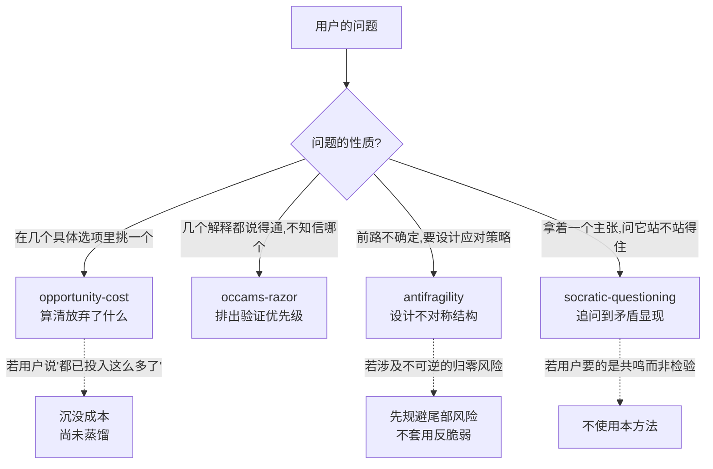

# ThinkingModels — 思维模型 Skill 索引

蒸馏自《万物皆模型》100个思维模型（原书卡片仅作参照，每个模型按真实学科来源重新研究）。

## 当前已有

| Skill | 中文名 | 学科来源 | 回答的问题 | 状态 |
|---|---|---|---|---|
| [opportunity-cost](opportunity-cost/SKILL.md) | 机会成本 | 微观经济学（Wieser） | 这个选择真正的代价是什么？ | v1.0 |
| [antifragility](antifragility/SKILL.md) | 反脆弱 | Taleb《反脆弱》(2012) | 不确定环境下怎么配置才能从波动中获益？ | v1.0 |
| [occams-razor](occams-razor/SKILL.md) | 奥卡姆剃刀 | 科学哲学（Ockham）+ 统计学模型选择 | 多个解释里先验证哪个？ | v1.0 |
| [socratic-questioning](socratic-questioning/SKILL.md) | 苏格拉底式质疑 | 柏拉图对话录 elenchus + Paul-Elder 框架 + CBT 引导式发现 | 这个主张自己站得住吗？ | v1.0 |

> `socratic-questioning` 不在《万物皆模型》100 个模型之列，是方法论补充；它同时是本仓库 skill 定稿前的强制自检工具（见 CLAUDE.md）。

## 如何区分（防误触发）

三个模型都可能被"这么做值不值 / 该怎么办"这类模糊表述命中，判据如下：

**关键区分**：
- **机会成本 vs 奥卡姆剃刀**：前者处理"选哪个方案"（决策问题，选项是行动），后者处理"信哪个解释"（认识问题，选项是假设）。
- **机会成本 vs 反脆弱**：前者假设选项已知且可比较，后者用于选项和结果都不确定、需要设计结构的场景。
- **反脆弱 vs 奥卡姆剃刀**：前者是策略问题（怎么配置资源），后者是认识论问题（哪个更可能对）。
- **苏格拉底式质疑 vs 奥卡姆剃刀**：前者检验**单个主张**内部是否自洽（手上只有一个结论），后者在**多个已成形的解释**中排优先级（手上有好几个候选）。
- **苏格拉底式质疑的元层级地位**：它可用于检验其余任何模型的应用是否恰当（"你确定这是机会成本场景，而不是沉没成本？"）。

## 共享术语

| 术语 | 含义 | 出现在 |
|---|---|---|
| 外显成本 / 隐含成本 | 账面支出 / 时间精力与错失收益 | opportunity-cost |
| 净收益 | 实际选择的价值 − 机会成本（**不等于**机会成本本身） | opportunity-cost |
| 归零风险 ruin risk | 不可逆的、导致彻底出局的尾部风险 | antifragility |
| 杠铃策略 Barbell | 两端配置（极保守 + 小比例高风险），避开中等风险 | antifragility |
| Via Negativa | 靠移除脆弱性来源变强，而非追加优势 | antifragility |
| 选择性 Optionality | 下行有限、上行无限的不对称收益结构 | antifragility |
| 伪坚韧 | 长期风平浪静但在累积尾部风险的状态（"感恩节前的火鸡"） | antifragility |
| 特设假设 ad hoc hypothesis | 为自圆其说而追加、本身无独立证据支持的环节 | occams-razor |
| 基础概率 base rate | 某原因在特定情境下本来的发生频率 | occams-razor |

## 待蒸馏（研究已完成，未构造 skill）

沉没成本、确认性偏差、逆向思维、第一性原理——研究记录见 `docs/books/wanwu-jie-moxing/candidates/`，下批次可直接复用。
