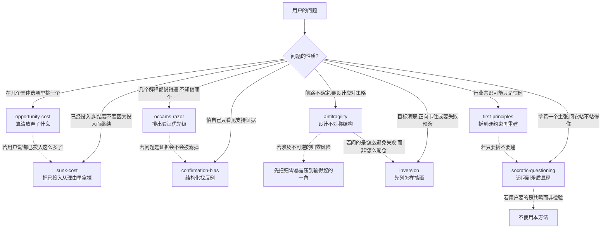

# ThinkingModels — 思维模型 Skill 索引

蒸馏自《万物皆模型》100个思维模型（原书卡片仅作参照，每个模型按真实学科来源重新研究）。

## 当前已有

| Skill | 中文名 | 学科来源 | 回答的问题 | 状态 |
|---|---|---|---|---|
| [opportunity-cost](opportunity-cost/SKILL.md) | 机会成本 | 微观经济学（Wieser） | 这个选择真正的代价是什么？ | v1.0 |
| [sunk-cost](sunk-cost/SKILL.md) | 沉没成本 | 经济学 sunk cost + Arkes & Blumer + Staw 承诺升级 | 要不要因为已经投入而继续？ | v1.0 |
| [antifragility](antifragility/SKILL.md) | 反脆弱 | Taleb《反脆弱》(2012) | 不确定环境下怎么配置才能从波动中获益？ | v1.0 |
| [occams-razor](occams-razor/SKILL.md) | 奥卡姆剃刀 | 科学哲学（Ockham）+ 统计学模型选择 | 多个解释里先验证哪个？ | v1.0 |
| [confirmation-bias](confirmation-bias/SKILL.md) | 确认性偏差 | Wason + Nickerson + Klayman & Ha | 我是不是在按已有信念筛选证据？ | v1.0 |
| [inversion](inversion/SKILL.md) | 逆向思维 | 芒格 inversion + Jacobi 启发 + Klein 事前验尸 | 怎样保证失败，从而避免它？ | v1.0 |
| [first-principles](first-principles/SKILL.md) | 第一性原理 | 亚里士多德 archê + 马斯克工程用法 | 这是硬约束还是行业惯例？ | v1.0 |
| [socratic-questioning](socratic-questioning/SKILL.md) | 苏格拉底式质疑 | 柏拉图对话录 elenchus + Paul-Elder 框架 + CBT 引导式发现 | 这个主张自己站得住吗？ | v1.0 |

> `socratic-questioning` 不在《万物皆模型》100 个模型之列，是方法论补充；它同时是本仓库 skill 定稿前的强制自检工具（见 CLAUDE.md）。

## 如何区分（防误触发）

"这么做值不值 / 该怎么办"这类模糊表述可能同时命中多个模型，判据如下：

**关键区分**：
- **机会成本 vs 沉没成本**：前者处理面向未来的互斥选择（放弃了什么）；后者处理已经收不回的投入是否在绑架当前判断。触发词"该选 A 还是 B"走机会成本；"都已经投入这么多了"走沉没成本。
- **机会成本 vs 奥卡姆剃刀**：前者处理"选哪个方案"（决策问题，选项是行动），后者处理"信哪个解释"（认识问题，选项是假设）。
- **机会成本 vs 反脆弱**：前者假设选项已知且可比较，后者用于选项和结果都不确定、需要设计结构的场景。
- **反脆弱 vs 奥卡姆剃刀**：前者是策略问题（怎么配置资源），后者是认识论问题（哪个更可能对）。
- **反脆弱 vs 逆向思维**：Via Negativa 服务于不对称收益结构；逆向思维是针对已定义目标的失败预演。"不确定下怎么配仓"走反脆弱；"这件事怎么搞砸"走逆向思维。
- **奥卡姆剃刀 vs 确认性偏差**：前者假定候选解释已经在桌上，只排验证顺序；后者处理证据怎么被搜集和加权。可连用：先补上被滤掉的反面解释，再按奥卡姆剃刀排序。
- **苏格拉底式质疑 vs 奥卡姆剃刀**：前者检验**单个主张**内部是否自洽（手上只有一个结论），后者在**多个已成形的解释**中排优先级（手上有好几个候选）。
- **苏格拉底式质疑 vs 确认性偏差**：前者追问主张的逻辑结构，后者追问证据采集过程。主张可以自洽，却建在被筛选过的证据上。
- **第一性原理 vs 逆向思维**：前者从硬约束往上建，后者从失败往回拆。"行业都这样但未必是物理"走第一性原理；"怎样保证搞砸"走逆向思维。
- **第一性原理 vs 奥卡姆剃刀**：已经有几个假说要排序，走奥卡姆剃刀；现有假说都建在类比上、需要拆地基，走第一性原理。
- **苏格拉底式质疑的元层级地位**：它可用于检验其余任何模型的应用是否恰当（"你确定这是机会成本场景，而不是沉没成本？"）。

## 共享术语

| 术语 | 含义 | 出现在 |
|---|---|---|
| 外显成本 / 隐含成本 | 账面支出 / 时间精力与错失收益 | opportunity-cost |
| 净收益 | 实际选择的价值 − 机会成本（**不等于**机会成本本身） | opportunity-cost |
| 从零出发测试 | 假装今天第一次面对，只看剩余成本与剩余收益 | sunk-cost |
| 承诺升级 escalation | 为证明当初没选错而向失败路径继续加码 | sunk-cost |
| 归零风险 ruin risk | 不可逆的、导致彻底出局的尾部风险 | antifragility |
| 杠铃策略 Barbell | 两端配置（极保守 + 小比例高风险），避开中等风险 | antifragility |
| Via Negativa | 靠移除脆弱性来源变强，而非追加优势 | antifragility |
| 选择性 Optionality | 下行有限、上行无限的不对称收益结构 | antifragility |
| 伪坚韧 | 长期风平浪静但在累积尾部风险的状态（"感恩节前的火鸡"） | antifragility |
| 特设假设 ad hoc hypothesis | 为自圆其说而追加、本身无独立证据支持的环节 | occams-razor |
| 基础概率 base rate | 某原因在特定情境下本来的发生频率 | occams-razor |
| 正例检验 positive test | 专找符合当前假设的例子；不总是非理性 | confirmation-bias |
| 预注册思维 | 先写下"什么证据会让我改主意"，再去看新证据 | confirmation-bias |
| 事前验尸 premortem | 假装已经失败，倒推原因再设防 | inversion |
| 硬约束 vs 惯例 | 物理/逻辑/真约束法规 vs 路径依赖的做法 | first-principles |

## 待蒸馏

《万物皆模型》其余约 90 个模型尚未开始研究（含 SWOT、PDCA、MECE、复利思维、第二序思维等）。01–18 中未纳入前两批的 11 个（直觉、决策树、易得性偏差、六顶思考帽等）也还没有进入 `candidates/`。

## 待蒸馏

《万物皆模型》其余约 90 个模型尚未开始研究（含 SWOT、PDCA、MECE、复利思维、第二序思维等）。01–18 中未纳入前两批的 11 个（直觉、决策树、易得性偏差、六顶思考帽等）也还没有进入 `candidates/`。
