# Thinking Models

通用可执行思维模型（推理、领导、沟通等杂项）。已按名录迁入学科分类的条目见下方「已迁出」；经济学/行为/系统/认知工具/决策/学习/战略/效率/复杂系统等主题优先落在对应平级目录。

路径：`skills/thinking-models/<skill-name>/SKILL.md`。

当前合计 **25** 个（本轮再迁出 25 个后）。

## Skills

- **[abductive-reasoning](./abductive-reasoning/SKILL.md)** — 溯因推理：用溯因推理（abduction / IBE）从令人惊讶的观察出发，生成并选择当前最佳解释假设，且标明待验
- **[contrarian-and-right](./contrarian-and-right/SKILL.md)** — 正确与非共识：用“正确且非共识”检验非常规判断：超额洞见/回报需要既偏离主流，又经得起证据与可证伪预测
- **[counterfactual-thinking](./counterfactual-thinking/SKILL.md)** — 反事实思维：用反事实思维处理“若非当时……就会……”的心理模拟：区分上行/下行反事实，把可控原因
- **[deductive-reasoning](./deductive-reasoning/SKILL.md)** — 演绎法：用演绎推理（deductive reasoning）从已接受的一般前提出发，按有效推理规则推出必然随之而来的结论
- **[dual-goal-list](./dual-goal-list/SKILL.md)** — 双目标清单：用双目标清单（常称 25/5 或两清单法则）强制聚焦：写下约 25 个目标，圈出 Top 5 为 List A
- **[dual-process](./dual-process/SKILL.md)** — 双系统：用卡尼曼双系统（System 1 快思考 / System 2 慢思考）帮用户判断何时该信任直觉、何时该强制慢下来：
- **[emotional-abc](./emotional-abc/SKILL.md)** — 情绪：用 Ellis 情绪 ABC（REBT）把强烈情绪拆成 A 触发事件、B 信念、C 情绪/行为后果：C 不由 A
- **[five-w-one-h](./five-w-one-h/SKILL.md)** — 5W1H（Who / What / When / Where / Why / How）：用 5W1H（Who/What/When/Where/Why/How）帮用户把事件、需求或任务的信息槽钉全，暴露缺腿事实
- **[fogg-behavior-model](./fogg-behavior-model/SKILL.md)** — 福格行为模型：用福格行为模型（B=MAP：动机 Motivation × 能力 Ability × 提示 Prompt）诊断行为为何发生或未发生：
- **[gaslighting](./gaslighting/SKILL.md)** — 煤气灯效应：用煤气灯效应识别“通过否认对方感知/记忆/判断来夺取现实定义权”的操纵模式
- **[hook-model](./hook-model/SKILL.md)** — HOOK 模型 Hook Model：用 HOOK 模型（Trigger → Action → Variable Reward → Investment）设计可反复发生的产品/习惯回路
- **[implicit-premises](./implicit-premises/SKILL.md)** — 隐含前提：用隐含前提（suppressed / implicit premises）把论证里“没写出来却托住结论”的前提补全并分类，
- **[johari-window](./johari-window/SKILL.md)** — 周哈里窗：用周哈里窗（开放/盲目/隐藏/未知四格）设计反馈与自我披露：扩大开放区以减少误解
- **[ladder-of-inference](./ladder-of-inference/SKILL.md)** — 推论阶梯：用推论阶梯把“从可见资料爬到信念与行动”的步骤摊开：选了哪些数据、加了什么含义与假设、
- **[local-global-optima](./local-global-optima/SKILL.md)** — 局部最优：用局部最优 vs 全局最优帮用户判断“继续打磨当前路径”是否已陷入小山峰：在邻域内最好，不代表
- **[long-term-thinking](./long-term-thinking/SKILL.md)** — 长线思考：用长线思考把决策放进多期后果与激励周期：显式写入近/中/远影响、谁在何种考核周期下行动、
- **[maslow-hierarchy](./maslow-hierarchy/SKILL.md)** — 马斯洛需求层次：把马斯洛需求层次当作“需求类别检查表”而非普遍定律：检查生理、安全、归属、尊重、自我实现
- **[munger-misjudgment](./munger-misjudgment/SKILL.md)** — 人类误判心理：用查理·芒格《人类误判心理学》的 25 种心理倾向做检查清单扫描，并识别 Lollapalooza
- **[negentropy](./negentropy/SKILL.md)** — 负熵：用负熵（negentropy）账本诊断开放系统如何靠输入自由能/信息维持局部有序，并排出废热与旧模式——
- **[process-replication](./process-replication/SKILL.md)** — 可复制化：把他人或自己的成功经验蒸馏成可迁移方法论，并按本地约束适配后再规模化：学习→提炼因果步骤→
- **[redundancy](./redundancy/SKILL.md)** — 冗余备份：用冗余/备份思维帮用户在故障、误差与单点失效面前设计容错：有意保留多余容量、路径或副本，
- **[situational-leadership](./situational-leadership/SKILL.md)** — 情境领导：用情境领导（Hersey-Blanchard / SL 思路）按下属在*具体任务*上的准备度（能力×意愿）切换督导风格
- **[socratic-questioning](./socratic-questioning/SKILL.md)** — 苏格拉底式质疑：用苏格拉底式质疑（elenchus 诘问法）检验一个主张站不站得住——不是靠反驳，而是靠追问，
- **[spiral-of-silence](./spiral-of-silence/SKILL.md)** — 沉默的螺旋：用沉默的螺旋诊断“怕被孤立 → 误判意见气候 → 少数派沉默 → 优势意见更响”的舆论动力
- **[ten-ten-ten](./ten-ten-ten/SKILL.md)** — 10/10/10 时间视角：用 Suzy Welch 的 10/10/10 帮用户从当下强烈情绪中拉开时间距离：分别写出一个选择在约 10 分钟、

## 已迁出（仍为可执行 Skill）

| Skill | 中文名 | 新路径 |
|---|---|---|
| [attribution-theory](../behavioral-biases/attribution-theory/SKILL.md) | 归因理论 | `behavioral-biases/` |
| [availability-heuristic](../behavioral-biases/availability-heuristic/SKILL.md) | 易得性启发 | `behavioral-biases/` |
| [confirmation-bias](../behavioral-biases/confirmation-bias/SKILL.md) | 确认性偏差 | `behavioral-biases/` |
| [dunning-kruger](../behavioral-biases/dunning-kruger/SKILL.md) | 邓宁-克鲁格效应 | `behavioral-biases/` |
| [loss-aversion](../behavioral-biases/loss-aversion/SKILL.md) | 损失规避 | `behavioral-biases/` |
| [peak-end-rule](../behavioral-biases/peak-end-rule/SKILL.md) | 峰终定律 | `behavioral-biases/` |
| [prospect-theory](../behavioral-biases/prospect-theory/SKILL.md) | 前景理论 | `behavioral-biases/` |
| [sunk-cost](../behavioral-biases/sunk-cost/SKILL.md) | 沉没成本 | `behavioral-biases/` |
| [survivorship-bias](../behavioral-biases/survivorship-bias/SKILL.md) | 幸存者偏差 | `behavioral-biases/` |
| [opportunity-cost](../econ-micro-markets/opportunity-cost/SKILL.md) | 机会成本 | `econ-micro-markets/` |
| [compounding](../finance-investing-models/compounding/SKILL.md) | 复利 | `finance-investing-models/` |
| [game-theory](../game-theory-models/game-theory/SKILL.md) | 博弈论 | `game-theory-models/` |
| [butterfly-effect](../systems-classic-effects/butterfly-effect/SKILL.md) | 蝴蝶效应 | `systems-classic-effects/` |
| [long-tail](../systems-classic-effects/long-tail/SKILL.md) | 长尾理论 | `systems-classic-effects/` |
| [metcalfes-law](../systems-classic-effects/metcalfes-law/SKILL.md) | 梅特卡夫法则 | `systems-classic-effects/` |
| [pareto-principle](../systems-classic-effects/pareto-principle/SKILL.md) | 二八定律 | `systems-classic-effects/` |
| [path-dependence](../systems-classic-effects/path-dependence/SKILL.md) | 路径依赖 | `systems-classic-effects/` |
| [serial-position-effect](../systems-classic-effects/serial-position-effect/SKILL.md) | 系列位置效应 | `systems-classic-effects/` |
| [systems-thinking](../systems-classic-effects/systems-thinking/SKILL.md) | 系统思维 | `systems-classic-effects/` |
| [antifragility](../learning-growth/antifragility/SKILL.md) | 反脆弱 | `learning-growth/` |
| [critical-thinking](../cognitive-thinking-tools/critical-thinking/SKILL.md) | 批判性思维 | `cognitive-thinking-tools/` |
| [decision-tree](../decision-probability/decision-tree/SKILL.md) | 决策树 | `decision-probability/` |
| [dissipative-structures](../systems-complexity/dissipative-structures/SKILL.md) | 耗散结构 | `systems-complexity/` |
| [economic-moat](../strategy-competition/economic-moat/SKILL.md) | 护城河 | `strategy-competition/` |
| [eisenhower-matrix](../efficiency-execution/eisenhower-matrix/SKILL.md) | 艾森豪威尔矩阵 | `efficiency-execution/` |
| [expected-value](../decision-probability/expected-value/SKILL.md) | 期望值 | `decision-probability/` |
| [feynman-technique](../learning-growth/feynman-technique/SKILL.md) | 费曼技巧 | `learning-growth/` |
| [first-principles](../cognitive-thinking-tools/first-principles/SKILL.md) | 第一性原理 | `cognitive-thinking-tools/` |
| [flow](../learning-growth/flow/SKILL.md) | 心流 | `learning-growth/` |
| [flywheel](../strategy-competition/flywheel/SKILL.md) | 飞轮 | `strategy-competition/` |
| [forgetting-curve](../learning-growth/forgetting-curve/SKILL.md) | 遗忘曲线 | `learning-growth/` |
| [golden-circle](../cognitive-thinking-tools/golden-circle/SKILL.md) | 黄金圈 | `cognitive-thinking-tools/` |
| [iceberg-model](../systems-complexity/iceberg-model/SKILL.md) | 冰山模型 | `systems-complexity/` |
| [inversion](../cognitive-thinking-tools/inversion/SKILL.md) | 逆向思维 | `cognitive-thinking-tools/` |
| [leverage](../systems-complexity/leverage/SKILL.md) | 杠杆 | `systems-complexity/` |
| [mece](../cognitive-thinking-tools/mece/SKILL.md) | MECE | `cognitive-thinking-tools/` |
| [metacognition](../learning-growth/metacognition/SKILL.md) | 元认知 | `learning-growth/` |
| [occams-razor](../cognitive-thinking-tools/occams-razor/SKILL.md) | 奥卡姆剃刀 | `cognitive-thinking-tools/` |
| [pdca](../efficiency-execution/pdca/SKILL.md) | PDCA | `efficiency-execution/` |
| [porters-five-forces](../strategy-competition/porters-five-forces/SKILL.md) | 波特五力 | `strategy-competition/` |
| [pyramid-principle](../cognitive-thinking-tools/pyramid-principle/SKILL.md) | 金字塔原理 | `cognitive-thinking-tools/` |
| [six-thinking-hats](../cognitive-thinking-tools/six-thinking-hats/SKILL.md) | 六顶思考帽 | `cognitive-thinking-tools/` |
| [swot](../strategy-competition/swot/SKILL.md) | SWOT | `strategy-competition/` |
| [tipping-point](../systems-complexity/tipping-point/SKILL.md) | 临界点/断裂点 | `systems-complexity/` |

下方防误触发图仅覆盖**仍留在本目录**的模型；已迁出项的分流见各目标分类 README 与对应 Skill「相关模型」。

## 如何区分（防误触发）

"这么做值不值 / 该怎么办"这类模糊表述可能同时命中多个模型，判据如下：

```mermaid
graph TD
    A[用户的问题] --> B{问题的性质?}
    B -->|选项明确但结果不确定,需估概率| DT[decision-tree<br/>画树算期望值]
    B -->|眼前情绪强,要看短中长期后果| TTT[ten-ten-ten<br/>10分/10月/10年]
    B -->|几个解释都说得通,不知信哪个| D[occams-razor<br/>排出验证优先级]
    B -->|行为会不会发生缺M/A/P| FB[fogg-behavior-model<br/>B=MAP]
    B -->|沟通/品牌先对齐目的| GC[golden-circle<br/>WHY-HOW-WHAT]
    B -->|反馈披露扩大互知| JW[johari-window<br/>四格开窗]
    B -->|该信直觉还是该强制慢下来| DP[dual-process<br/>检查反馈与唤起条件]
    B -->|前路不确定,要设计应对策略| E[antifragility<br/>设计不对称结构]
    B -->|会议里事实情绪风险搅在一起| HATS[six-thinking-hats<br/>分帽并行思考]
    B -->|目标清楚,正向卡住或要失败预演| INV[inversion<br/>先列怎样搞砸]
    B -->|行业共识可能只是惯例| FP[first-principles<br/>拆到硬约束再重建]
    B -->|产品/激励可能打错需求类别| MAS[maslow-hierarchy<br/>扫描需求类别]
    B -->|待办过载,急事要事搅在一起| EM[eisenhower-matrix<br/>四象限排程]
    B -->|怀疑当前路径只是小山峰| LG[local-global-optima<br/>算换山下坡]
    B -->|挑战技能不匹配,难进专注| FL[flow<br/>调挑战或技能]
    B -->|要把问题拆成不重不漏的类| ME[mece<br/>互斥穷尽]
    B -->|要设计或诊断增长因果闭环| FW[flywheel<br/>画可测飞轮]
    B -->|战略内外态势盘点| SW[swot<br/>四格加TOWS匹配]
    B -->|持续改进怎么转下一圈| PC[pdca<br/>Plan-Do-Check-Act]
    B -->|论证缺腿/未说出的前提| IP[implicit-premises<br/>补全隐含前提]
    B -->|前提真时结论是否必然| DR[deductive-reasoning<br/>有效vs可靠]
    B -->|最佳解释假设是哪个| AR[abductive-reasoning<br/>溯因]
    B -->|结论先行怎么写| PY[pyramid-principle<br/>金字塔]
    B -->|单点故障备份| RD[redundancy<br/>冗余]
    B -->|监控调节自己的思考| MC[metacognition<br/>元认知]
    B -->|复习对抗遗忘| FC[forgetting-curve<br/>间隔重复]
    B -->|临近临界翻转| TP[tipping-point<br/>临界质量]
    B -->|哪里撬动最大| LV[leverage<br/>杠杆点]
    B -->|意见气候使人沉默| SS[spiral-of-silence]
    B -->|从数据爬到信念行动| LI[ladder-of-inference]
    B -->|若非当时会怎样| CF[counterfactual-thinking]
    B -->|澄清事实六问| W6[five-w-one-h]
    B -->|习惯回路四步| HK[hook-model]
    B -->|领导风格配准备度| SL[situational-leadership]
    B -->|信念中介情绪| ABC[emotional-abc]
    B -->|非共识且可检验正确| CR[contrarian-and-right]
    B -->|产业五力利润池| PF[porters-five-forces]
    B -->|竞争壁垒能否持续| EM2[economic-moat]
    B -->|跨期权衡承诺装置| LTT[long-term-thinking]
    B -->|组织文化可见层下| IB[iceberg-model]
    B -->|用自己的话讲清缺口| FY[feynman-technique]
    B -->|拿着一个主张,问它站不站得住| H[socratic-questioning<br/>追问到矛盾显现]

    E -.->|若涉及不可逆的归零风险| G[先把归零暴露压到输得起的一角]
    E -.->|若问的是'怎么避免失败'而非'怎么配仓'| INV
    H -.->|若用户要的是共鸣而非检验| I[不使用本方法]
    FP -.->|若只要拆不要建| H
    FL -.->|若问题是行为根本没发生| FB
    FB -.->|若已能发生但体验不匹配| FL
    GC -.->|若要的是战略态势而非叙事| SW
    EM -.->|若怀疑整座山错了| LG
    FW -.->|若各环要迭代改进| PC
    ME -.->|若要的是结论先行写作结构| PY
    DR -.->|若问最佳解释而非必然推出| AR
    AR -.->|若只排解释简单度| D
    FB -.->|若要的是习惯回路产品设计| HK
    INV -.->|若问若非当时会怎样| CF
    SW -.->|若问产业竞争结构| PF
    PF -.->|若问主体可持续壁垒| EM2
    TTT -.->|若问跨期制度/承诺而非三时点感受| LTT
    E -.->|若只要备份容错| RD
```

**关键区分**：
- **已迁出经济学/效应分类的模型**：机会成本、沉没成本、前景理论/损失规避、确认/易得/幸存/邓克/峰终/归因、博弈论入门、复利、系统思维与经典效应（蝴蝶/二八/长尾/路径依赖/梅特卡夫/系列位置）等——防误触发以各目标分类 README 与 Skill「相关模型」为准，不再占用本图主分支。
- **双系统 vs 确认性偏差（后者已迁至 `behavioral-biases/`）**：前者管何时调用慢思考；后者管证据是否被立场过滤（慢系统仍可能合理化）。详见 [`confirmation-bias`](../behavioral-biases/confirmation-bias/SKILL.md)。
- **艾森豪威尔 vs 局部/全局最优**：前者排同一路径上的优先级；后者问要不要付代价换山。
- **复利 vs 飞轮（复利已迁至 `finance-investing-models/`）**：复利查再投入×时间；飞轮必须画出可测因果闭环。详见 [`compounding`](../finance-investing-models/compounding/SKILL.md)。
- **SWOT vs MECE**：SWOT 是四格态势+匹配；MECE 是任意议题的不重不漏纪律。
- **PDCA vs 飞轮**：飞轮定义推哪一环；PDCA 迭代怎么推。
- **心流 vs 福格**：体验通道匹配 vs 行为是否发生（B=MAP）。
- **邓克 vs 周哈里窗**：表现-自评校准（含复制争议）vs 人际信息四格与反馈披露。
- **黄金圈 vs SWOT**：叙事一致性 vs 内外态势匹配；黄金圈不是万能领导定律。
- **反脆弱 vs 逆向思维**：配仓 vs 失败预演。
- **MECE vs 金字塔原理**：分类纪律 vs 结论先行的表达结构。
- **演绎 vs 溯因 vs 奥卡姆**：必然推出 vs 最佳解释 vs 解释优先排序。
- **福格 vs HOOK**：单次行为发生条件 vs 习惯回路产品设计。
- **反脆弱 vs 冗余**：从波动获益的结构 vs 备份容错。
- **10/10/10 vs 长线思考 vs 复利（复利已迁至 `finance-investing-models/`）**：三时点感受 vs 跨期承诺装置 vs 再投入机制。
- **SWOT vs 五力 vs 护城河**：主体内外态势 vs 产业竞争结构 vs 可持续壁垒。
- **苏格拉底式质疑的元层级地位**：可用于检验其余任何模型的应用是否恰当。

## 共享术语

| 术语 | 含义 | 出现在 |
|---|---|---|
| 决策节点 / 机会节点 | 你可控的选择 vs 自然/对手给出的不确定分支 | decision-tree |
| 期望值 EV | Σ(结果 × 概率)；决策树叶子价值的加权 | decision-tree |
| 情感预测 affective forecasting | 人对未来感受的预测往往不准 | ten-ten-ten |
| 归零风险 ruin risk | 不可逆的、导致彻底出局的尾部风险 | antifragility |
| 杠铃策略 Barbell | 两端配置（极保守 + 小比例高风险），避开中等风险 | antifragility |
| Via Negativa | 靠移除脆弱性来源变强，而非追加优势 | antifragility |
| 选择性 Optionality | 下行有限、上行无限的不对称收益结构 | antifragility |
| 伪坚韧 | 长期风平浪静但在累积尾部风险的状态（"感恩节前的火鸡"） | antifragility |
| 特设假设 ad hoc hypothesis | 为自圆其说而追加、本身无独立证据支持的环节 | occams-razor |
| 基础概率 base rate | 某原因在特定情境下本来的发生频率 | occams-razor / availability-heuristic |
| 蓝帽 Blue Hat | 主持思考过程本身的角色，不是内容贡献者 | six-thinking-hats |
| 事前验尸 premortem | 假装已经失败，倒推原因再设防 | inversion |
| 硬约束 vs 惯例 | 物理/逻辑/真约束法规 vs 路径依赖的做法 | first-principles |
| 缺陷需求 / 成长需求 | 不足会引起痛苦的下层需求 / 自我实现类上层需求 | maslow-hierarchy |
| System 1 / System 2 | 快自动联想 vs 慢费力规则加工 | dual-process |
| 邻域 / 下坡成本 | 局部可微调的范围 / 换山前必经的暂时变差 | local-global-optima |
| 第 II 象限 | 重要但不紧急——预防与能力建设的杠杆区 | eisenhower-matrix |
| 挑战-技能匹配 | 挑战与技能大致相当才易进通道 | flow |
| ME / CE | 相互独立 / 完全穷尽（相对议题边界） | mece |
| 飞轮闭环 | 可命名、可测的互相加强因果圈 | flywheel |
| TOWS 匹配 | SO/WO/ST/WT 由四格交叉出选项 | swot |
| PDSA | Plan-Do-Study-Act；强调学习不止合格检验 | pdca |
| B=MAP | Behavior = Motivation × Ability × Prompt | fogg-behavior-model |
| 行动线 action line | 动机×能力足够时提示才能触发行为 | fogg-behavior-model |
| WHY / HOW / WHAT | 目的 / 方法原则 / 产品与行动 | golden-circle |
| 开放/盲目/隐藏/未知 | 周哈里窗四格（己知×他知） | johari-window |
| 隐含前提 / enthymeme | 论证有效性所需但表面未写出的前提 | implicit-premises |
| 有效 vs 可靠 | 形式必然推出 vs 前提亦为真 | deductive-reasoning |
| 可见层 / 假设层 | 组织文化冰山：器物行为 vs 底层假设 | iceberg-model |
| 费曼缺口 | 无法用自己的话讲清处即未掌握处 | feynman-technique |
| 结论先行 | 先答再分组论证支撑 | pyramid-principle |
| 主动/待机冗余 | 并行备份 vs 故障切换备份 | redundancy |
| 认知监控 | 对思维过程的觉察与调节 | metacognition |
| 间隔重复 | 按遗忘节奏安排复习 | forgetting-curve |
| 临界质量 | 越过阈值后行为不可逆翻转 | tipping-point |
| 杠杆点 | 改变系统行为的高产出结构位置 | leverage |
| 意见气候 | 感知中的多数意见氛围 | spiral-of-silence |
| 推论阶梯 | 资料→赋义→结论→行动的攀升 | ladder-of-inference |
| 上行/下行反事实 | 若更好/若更差的“若非”模拟 | counterfactual-thinking |
| 5W1H | Who/What/When/Where/Why/How | five-w-one-h |
| Trigger–Action–Reward–Investment | HOOK 四步习惯回路 | hook-model |
| 准备度 | 情境领导中的能力×意愿 | situational-leadership |
| 溯因 | 选当前最佳解释假设 | abductive-reasoning |
| A–B–C | 事件–信念–情绪/行为后果 | emotional-abc |
| 非共识且正确 | 少数派且可检验为真 | contrarian-and-right |
| 承诺装置 | 约束未来短视的制度/机制 | long-term-thinking |
| 过程复制 | 成功经验→适配本地的可迁移方法论 | process-replication |
| 负熵 / 熵减 | 开放系统输入有序/能量以维持局部有序 | negentropy |
| Lollapalooza | 多心理倾向同向叠加的极端误判 | munger-misjudgment |
| 现实定义权 | 谁有权裁定「发生了什么」 | gaslighting |
| List A / List B | 最重要目标 vs 绝对回避的诱人次要目标 | dual-goal-list |

## 待蒸馏

第八批 8 个已构造（见 `candidates/batch-8-remaining-eight.md`）。第七批见 `batch-7-next-thirty.md`。既往拒绝项（三脑、升维、万物联系等）仍不构造。

原书可验证卡片已基本消化；后续仅在三重验证仍通过时增量补漏。研究记录见本机 `docs/books/wanwu-jie-moxing/candidates/`。

## Other categories

[`behavioral-biases`](../behavioral-biases/) · [`business`](../business/) · [`cognitive-thinking-tools`](../cognitive-thinking-tools/) · [`decision-probability`](../decision-probability/) · [`econ-macro-theories`](../econ-macro-theories/) · [`econ-micro-markets`](../econ-micro-markets/) · [`efficiency-execution`](../efficiency-execution/) · [`finance-investing-models`](../finance-investing-models/) · [`game-theory-models`](../game-theory-models/) · [`learning-growth`](../learning-growth/) · [`strategy-competition`](../strategy-competition/) · [`systems-classic-effects`](../systems-classic-effects/) · [`systems-complexity`](../systems-complexity/)
